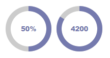
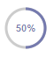

# ProgressJS

Display any progress or data within an animated (radial) progress bar.



## Installation

Include the provided snippet as you like in your markup. 
This snippet works properly when included in the `<head>` tag 
but also when appended at the end of the body.

```html
// ...
<script src="/js/progress.js"></script>
// ...
</body>
```

## Usage

Feel free to place a `<div>` container with the following class name into your markup wherever 
the progress bar should show up.

```html
<div class="progress-js"></div>
```

This will render the progress bar with the default settings. You are able 
to set various options within the `<div>` container by yourself.

### Options

The following options are available to be set on the `<div>` container.

- width (default: 100)      
- height (default: 100)     
- strokeWidth (default: 10)
- fgColor (default: #757AAE)    
- bgColor (default: #CCCCCC)
- fontSize (default: 1rem)
- fontWeight (default: 900)
- duration (default: 2s)   
- value (default: 0)      
- overall (default: 100)
- suffix (default: %)     
- shadow (default: false)

You can use these as follows:

```html
<div class="progress-js" data-width="50" data-height="50" data-stroke-width="3" data-value="50" data-font-size=".7rem" data-font-weight="300"></div>
```

The example above will produce a small and thin progress circle, starting at 50 percent.



### Updating values

Along with the container adjustments, a proxy object is being injected into the global window object. 

You can access it from everywhere and update specific progress bars as follows:

```html
// ...
<div class="progress-js"></div>
// ...

<script>
    progressJs.update('progress-js-1', 50);
</script>
```

The first argument is the internal id which simply is the term `progress-js-` along with the actual index number, 
e.g. use `progress-js-1` for the first ever created progress bar, `progress-js-2` for the second one and so on.


### Manually creating a progress bar

| <span style="white-space: nowrap;">**⚠ NOTICE**</span> | This is currently not supported, but is planned for the future. |
|--------------------------------------------------------|-----------------------------------------------------------------|

Just place a container where your progress bar should show up and wire it
with the created Progress object.

```html
// ...
<div class="custom-class"></div>
// ...

<script>
    // const progressBar = new Progress('custom-class');
    const progressBar = new Progress(document.querySelector('custom-class'));
    progressBar.render();
    // ...
    progressBar.update(50);
</script>

```